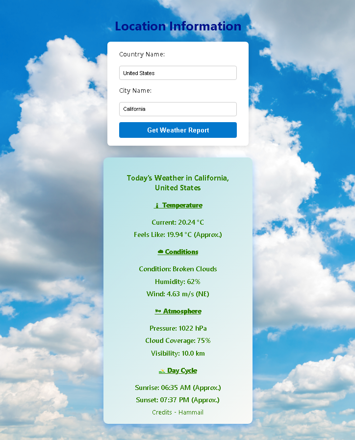

# 🌦️ Flask Weather App

A simple and elegant **Flask web application** that provides real-time weather information for any city worldwide.  
The app fetches weather data using a public weather API and displays details such as **temperature**, **humidity**, **wind speed**, and **weather conditions** etc.

---

## 📸 Screenshot
   

---

## 🚀 Features

- **City-based Search** → Enter any city name to get weather data instantly.
- **Real-Time Weather** → Fetches live weather details from an external API.
- **User-Friendly Interface** → Clean, minimal, and responsive design.
- **Error Handling** → Alerts the user if the city is not found.
- **Country Code Detection** → Automatically fetches country names from codes.
- **Custom Background** → Change the background image easily via the `/Statics` folder.

---

## ⚙️ How It Works

1. **User Input** → You enter a city name in the search bar.
2. **Flask Backend** → The app sends the city name to the backend.
3. **API Request** → The backend queries the OpenWeatherMap (or your chosen API) for real-time data.
4. **Response Parsing** → The JSON response is processed to extract useful information like:
   - Temperature
   - Weather condition
   - Wind speed
   - Humidity
   - Sunrise
   - Sunset etc
5. **Frontend Display** → The results are displayed on a web page with a clean UI.

---
## About API
In this Weather app we use free API from https://openweathermap.org/ by just Signing in. You have to get your own api this contain a dummy API in .env file. You just have to paste you API in .env file and run the app.

---
## Use Live app
In this Weather is live click [here](https://hammailriazweb.pythonanywhere.com/)

